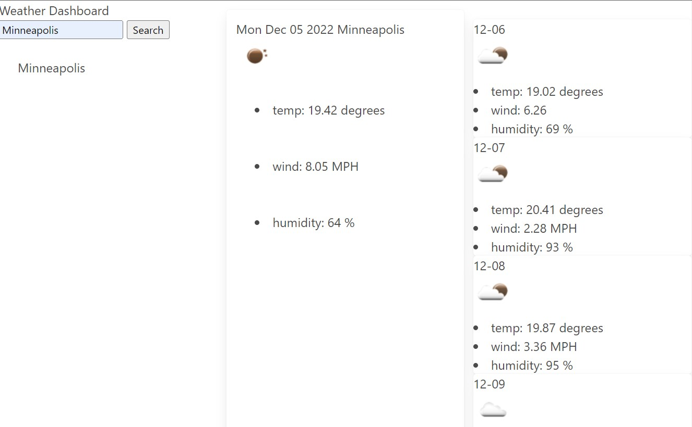

## Description
This is a weather application that retrieves the current weather along with the five-day forecast from the API at https://openweathermap.org/. The city searched by the user is displayed on the left-hand side of the page and searches are stacked there until the page is refreshed. Clicking on a city in the searches will also bring up the weather data for that city. 

## Installation
Website is available here: https://llangerud.github.io/weather-dashboard and looks like this:

## Usage
Type a city in the search box to see weather data. This application uses jQuery, Bulma and the OpenWeather API. It is formatted for desktop and mobile with the help of Bulma's mobile-first elements. 

Credits
N/A

License
See License
